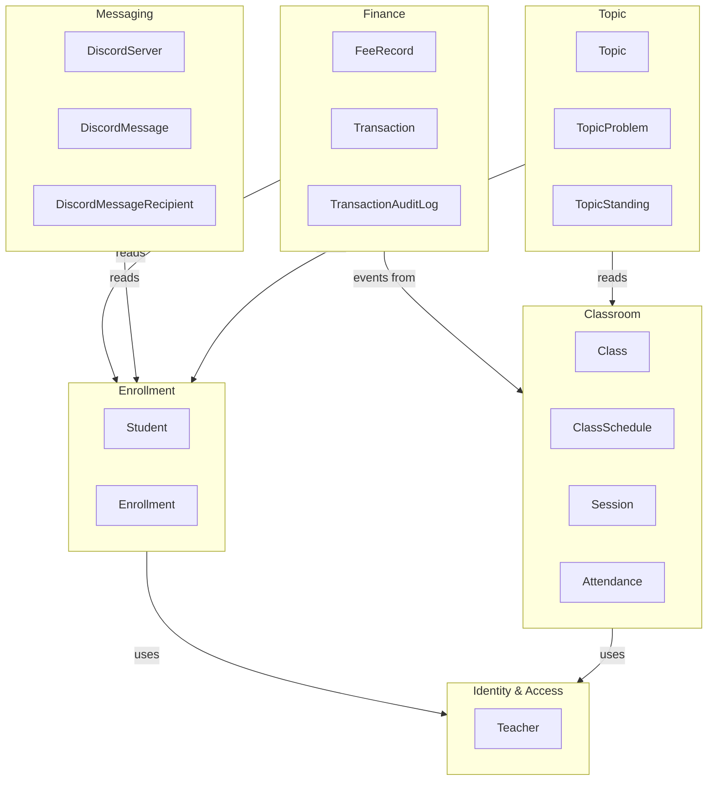

# TMS Backend — Kế hoạch Refactor sang Modular Monolith

## 1. Phân tích hiện trạng

### 1.1 Cấu trúc hiện tại

```
src/
├── config.ts                    # Global config
├── data-source.ts               # Singleton AppDataSource
├── database-integrity.ts        # DB constraints
├── entities/                    # TẤT CẢ entities chung 1 folder
│   ├── student.entity.ts
│   ├── class.entity.ts
│   ├── session.entity.ts
│   ├── fee-record.entity.ts
│   └── ... (18 files)
├── index.ts                     # Entry point, mount tất cả routers
├── integrations/                # External APIs (Discord, Codeforces)
├── jobs/                        # Background job runner
├── modules/
│   ├── students/                # Procedural: exported functions
│   ├── classes/                 # Procedural: exported functions
│   ├── sessions/                # Procedural: exported functions
│   ├── finance/                 # Procedural: exported functions
│   ├── identity/                # Auth, RBAC, ownership
│   ├── messaging/               # Discord messaging
│   └── topic/                   # Codeforces topics
└── shared/
    ├── errors/                  # Error classes (5 files riêng lẻ)
    ├── helpers/
    ├── middlewares/              # async-handler, validate
    └── schemas/
```

### 1.2 Các vấn đề chính

| # | Vấn đề | Ví dụ cụ thể |
|---|--------|---------------|
| 1 | **Procedural programming** | Service files export loose functions: `export async function createStudent(...)`, `export async function listStudents(...)` |
| 2 | **Global singleton DB** | Mọi service truy cập `AppDataSource` trực tiếp — không có request-scoped context |
| 3 | **Không có bounded context** | `entities/` chứa tất cả 18 entity chung; `student.service.ts` import `Class`, `Enrollment`, `Transaction`, `DiscordServer` |
| 4 | **Cross-module coupling** | `class.service.ts` import trực tiếp `cancelFeeRecordsForSessions` từ finance; `sessions.service.ts` import `syncAttendanceFeeRecord` |
| 5 | **Duplicated helpers** | `parseAmountToBigInt()` lặp lại trong 3 files; `requireClassById()` lặp trong 2 modules; `getTeacherId()` lặp trong mọi controller |
| 6 | **Entities chia sẻ toàn cục** | Không rõ entity nào thuộc context nào — mọi module đều import từ `../../entities/index.js` |
| 7 | **Error classes phân mảnh** | 5 error classes riêng lẻ (`ServiceError`, `StudentServiceError`, `ClassServiceError`, `AuthError`, `AppError`) không có hierarchy rõ ràng |
| 8 | **Controller boilerplate** | Mỗi controller lặp lại `getTeacherId()`, error handler, passport auth middleware |

---

## 2. Kiến trúc đích: Modular Monolith

### 2.1 Cấu trúc thư mục mới

```
src/
├── app.ts                           # Express app setup + middleware pipeline
├── server.ts                        # Entry: khởi tạo DB, jobs, listen
├── config.ts                        # Giữ nguyên
│
├── infrastructure/                  # ── Layer hạ tầng ──
│   ├── database/
│   │   ├── data-source.ts           # AppDataSource
│   │   ├── database-integrity.ts
│   │   ├── db-context.ts            # ★ RequestDbContext class
│   │   └── db-context.middleware.ts  # ★ Middleware attach vào req
│   ├── http/
│   │   ├── base.controller.ts       # ★ Abstract BaseController
│   │   ├── async-handler.ts
│   │   ├── validate.middleware.ts
│   │   └── error-handler.middleware.ts  # ★ Unified error handler
│   └── jobs/
│       ├── job-runner.ts
│       └── job.types.ts
│
├── shared/                          # ── Shared kernel ──
│   ├── errors/
│   │   └── domain.error.ts          # ★ Một DomainError base duy nhất
│   ├── types/
│   │   └── express.d.ts             # ★ Augment Request với dbContext
│   └── helpers/
│       └── money.ts                 # ★ parseAmountToBigInt (một chỗ)
│
├── modules/                         # ── Bounded Contexts ──
│   ├── identity/                    # Context: Identity & Access
│   │   ├── domain/
│   │   │   └── teacher.entity.ts
│   │   ├── identity.service.ts      # ★ Class IdentityService
│   │   ├── identity.repository.ts
│   │   ├── identity.controller.ts
│   │   ├── identity.module.ts       # ★ Module registration
│   │   ├── auth.passport.ts
│   │   ├── auth.rbac.ts
│   │   ├── auth.ownership.ts
│   │   └── index.ts
│   │
│   ├── enrollment/                  # Context: Student & Enrollment
│   │   ├── domain/
│   │   │   ├── student.entity.ts
│   │   │   └── enrollment.entity.ts
│   │   ├── enrollment.service.ts    # ★ Class EnrollmentService
│   │   ├── enrollment.repository.ts
│   │   ├── enrollment.controller.ts
│   │   ├── enrollment.module.ts
│   │   ├── enrollment.types.ts
│   │   ├── enrollment.schemas.ts
│   │   ├── reports/
│   │   └── index.ts
│   │
│   ├── classroom/                   # Context: Class & Session Management
│   │   ├── domain/
│   │   │   ├── class.entity.ts
│   │   │   ├── class-schedule.entity.ts
│   │   │   ├── session.entity.ts
│   │   │   └── attendance.entity.ts
│   │   ├── classroom.service.ts     # ★ Class ClassroomService
│   │   ├── session.service.ts       # ★ Class SessionService
│   │   ├── classroom.repository.ts
│   │   ├── session.repository.ts
│   │   ├── classroom.controller.ts
│   │   ├── session.controller.ts
│   │   ├── classroom.module.ts
│   │   └── index.ts
│   │
│   ├── finance/                     # Context: Finance
│   │   ├── domain/
│   │   │   ├── fee-record.entity.ts
│   │   │   ├── transaction.entity.ts
│   │   │   └── transaction-audit-log.entity.ts
│   │   ├── finance.service.ts       # ★ Class FinanceService
│   │   ├── finance.repository.ts
│   │   ├── finance.controller.ts
│   │   ├── finance.module.ts
│   │   ├── reports/
│   │   └── index.ts
│   │
│   ├── messaging/                   # Context: Discord Messaging
│   │   ├── domain/
│   │   │   ├── discord-server.entity.ts
│   │   │   ├── discord-message.entity.ts
│   │   │   └── discord-message-recipient.entity.ts
│   │   ├── messaging.service.ts     # ★ Class MessagingService
│   │   ├── messaging.repository.ts
│   │   ├── messaging.controller.ts
│   │   ├── messaging.module.ts
│   │   └── index.ts
│   │
│   └── topic/                       # Context: Codeforces Topics
│       ├── domain/
│       │   ├── topic.entity.ts
│       │   ├── topic-problem.entity.ts
│       │   └── topic-standing.entity.ts
│       ├── topic.service.ts         # ★ Class TopicService
│       ├── topic.repository.ts
│       ├── topic.controller.ts
│       ├── topic.module.ts
│       └── index.ts
│
└── integrations/                    # External service adapters
    ├── discord/
    └── codeforces/
```

### 2.2 Bounded Contexts & Ownership



---

## 3. Các thay đổi chính (Chi tiết)

### 3.1 Request-Scoped DB Context

**Mục tiêu**: Mỗi HTTP request có `EntityManager` riêng, hỗ trợ transaction xuyên suốt request.

**File mới**: `src/infrastructure/database/db-context.ts`

```typescript
import { DataSource, EntityManager, QueryRunner } from 'typeorm';

export class DbContext {
  private queryRunner: QueryRunner | null = null;

  constructor(private readonly dataSource: DataSource) {}

  get manager(): EntityManager {
    return this.queryRunner?.manager ?? this.dataSource.manager;
  }

  async beginTransaction(): Promise<void> {
    this.queryRunner = this.dataSource.createQueryRunner();
    await this.queryRunner.connect();
    await this.queryRunner.startTransaction();
  }

  async commit(): Promise<void> {
    await this.queryRunner?.commitTransaction();
  }

  async rollback(): Promise<void> {
    await this.queryRunner?.rollbackTransaction();
  }

  async release(): Promise<void> {
    await this.queryRunner?.release();
    this.queryRunner = null;
  }

  get isInTransaction(): boolean {
    return this.queryRunner?.isTransactionActive ?? false;
  }
}
```

**File mới**: `src/infrastructure/database/db-context.middleware.ts`

```typescript
import { RequestHandler } from 'express';
import { AppDataSource } from './data-source';

export const attachDbContext: RequestHandler = (req, _res, next) => {
  req.dbContext = new DbContext(AppDataSource);
  next();
};
```

**File mới**: `src/shared/types/express.d.ts`

```typescript
import { DbContext } from '../../infrastructure/database/db-context';
import { Teacher } from '../../modules/identity/domain/teacher.entity';

declare global {
  namespace Express {
    interface Request {
      dbContext: DbContext;
      teacher?: Teacher;
    }
  }
}
```

### 3.2 Service Classes (OOP)

**Mục tiêu**: Chuyển từ exported functions sang class-based services nhận `DbContext` qua constructor hoặc method parameter.

**Ví dụ**: `EnrollmentService` (thay thế `student.service.ts` hiện tại)

```typescript
export class EnrollmentService {
  constructor(
    private readonly db: DbContext,
    private readonly financeService: FinanceService, // Injected dependency
  ) {}

  async listStudents(teacherId: number, filters: StudentListFilters): Promise<StudentSummary[]> {
    const manager = this.db.manager;
    const repo = new EnrollmentRepository(manager);
    // ... business logic
  }

  async createStudent(teacherId: number, input: CreateStudentInput): Promise<StudentSummary> {
    await this.db.beginTransaction();
    try {
      const manager = this.db.manager;
      // ... business logic
      await this.db.commit();
      return result;
    } catch (error) {
      await this.db.rollback();
      throw error;
    } finally {
      await this.db.release();
    }
  }
}
```

### 3.3 Base Controller

**Mục tiêu**: Loại bỏ boilerplate lặp lại trong mọi controller.

```typescript
export abstract class BaseController {
  readonly router = Router();

  constructor() {
    this.router.use(passport.authenticate('jwt', { session: false }));
    this.initializeRoutes();
    this.router.use(this.handleError.bind(this));
  }

  protected abstract initializeRoutes(): void;

  protected getTeacher(req: Request): Teacher {
    if (!req.user) throw new DomainError('unauthorized', 401);
    return req.user as Teacher;
  }

  protected getDbContext(req: Request): DbContext {
    return req.dbContext;
  }

  private handleError(err: unknown, _req: Request, res: Response, next: NextFunction): void {
    if (err instanceof DomainError) {
      res.status(err.statusCode).json({ error: err.message });
      return;
    }
    next(err);
  }
}
```

### 3.4 Module Registration

Mỗi bounded context export một `Module` object chứa metadata để `app.ts` tự động đăng ký:

```typescript
// enrollment.module.ts
export const enrollmentModule = {
  name: 'enrollment',
  entities: [Student, Enrollment],
  createController: () => new EnrollmentController(),
  createJobs: () => [], // no background jobs
};
```

```typescript
// app.ts
const modules = [identityModule, enrollmentModule, classroomModule, financeModule, messagingModule, topicModule];

for (const mod of modules) {
  app.use(config.apiPrefix, mod.createController().router);
}
```

### 3.5 Unified Error Hierarchy

```typescript
// shared/errors/domain.error.ts
export class DomainError extends Error {
  constructor(
    message: string,
    public readonly statusCode: number = 400,
    public readonly code?: string,
  ) {
    super(message);
  }
}

// Mỗi module extend nếu cần
export class EnrollmentError extends DomainError {}
export class FinanceError extends DomainError {}
```

### 3.6 Cross-Module Communication

Thay vì import trực tiếp, dùng **service injection** qua constructor:

```
Hiện tại (tight coupling):
  class.service.ts → import { cancelFeeRecordsForSessions } from '../finance/index.js'

Sau refactor (loose coupling):
  ClassroomService constructor nhận FinanceService interface
```

```typescript
// Khai báo interface ở shared hoặc ở module consumer
interface IFinanceFeeSync {
  cancelFeeRecordsForSessions(manager: EntityManager, teacherId: number, sessionIds: number[], cancelledAt: Date): Promise<number>;
  syncAttendanceFeeRecord(manager: EntityManager, input: SyncFeeInput): Promise<void>;
}

// ClassroomService nhận interface
export class SessionService {
  constructor(
    private readonly db: DbContext,
    private readonly feeSync: IFinanceFeeSync,
  ) {}
}
```

---

## 4. Kế hoạch thực hiện (6 phases)

### Phase 0: Infrastructure Foundation
**Effort**: 1–2 ngày | **Risk**: Thấp

| Task | Chi tiết |
|------|----------|
| 0.1 | Tạo `infrastructure/database/db-context.ts` và `db-context.middleware.ts` |
| 0.2 | Tạo `shared/types/express.d.ts` — augment Express Request |
| 0.3 | Tạo `shared/errors/domain.error.ts` — unified error class |
| 0.4 | Tạo `shared/helpers/money.ts` — consolidate `parseAmountToBigInt` |
| 0.5 | Tạo `infrastructure/http/base.controller.ts` |
| 0.6 | Mount `attachDbContext` middleware vào app pipeline |
| 0.7 | Tách `index.ts` thành `app.ts` + `server.ts` |

> [!IMPORTANT]
> Phase 0 không thay đổi behavior — chỉ thêm infrastructure mới song song với code cũ.

---

### Phase 1: Identity Module
**Effort**: 1 ngày | **Risk**: Thấp

| Task | Chi tiết |
|------|----------|
| 1.1 | Di chuyển `teacher.entity.ts` vào `modules/identity/domain/` |
| 1.2 | Refactor `auth.service.ts` → class `IdentityService` |
| 1.3 | Refactor `admin.service.ts` → method trong `IdentityService` |
| 1.4 | Refactor controllers kế thừa `BaseController` |
| 1.5 | Tạo `identity.module.ts` |
| 1.6 | Update `auth.ownership.ts` dùng `req.dbContext` thay vì `AppDataSource` |

---

### Phase 2: Enrollment Module (Students)
**Effort**: 2–3 ngày | **Risk**: Trung bình

| Task | Chi tiết |
|------|----------|
| 2.1 | Di chuyển `student.entity.ts`, `enrollment.entity.ts` vào `modules/enrollment/domain/` |
| 2.2 | Refactor `student.service.ts` → class `EnrollmentService` |
| 2.3 | Chuyển `student.repository.ts` → class `EnrollmentRepository(manager)` |
| 2.4 | Service methods nhận `DbContext` thay vì dùng `AppDataSource` trực tiếp |
| 2.5 | Tách Discord automation ra khỏi service → dùng messaging interface |
| 2.6 | Refactor controller kế thừa `BaseController` |
| 2.7 | Tạo `enrollment.module.ts` |
| 2.8 | Di chuyển reports vào `enrollment/reports/` |

> [!WARNING]
> Module này có cross-dependency với Finance (balance snapshot) và Messaging (Discord kick/invite). Cần define interface trước khi refactor.

---

### Phase 3: Classroom Module (Classes + Sessions)
**Effort**: 3–4 ngày | **Risk**: Trung bình–Cao

| Task | Chi tiết |
|------|----------|
| 3.1 | Di chuyển `class.entity.ts`, `class-schedule.entity.ts`, `session.entity.ts`, `attendance.entity.ts` vào `modules/classroom/domain/` |
| 3.2 | Tách `class.service.ts` (832 dòng) → `ClassroomService` + `SessionService` |
| 3.3 | `ClassroomService`: quản lý CRUD class, schedules |
| 3.4 | `SessionService`: quản lý sessions, attendance, session reconciliation |
| 3.5 | Define `IFinanceFeeSync` interface cho cross-module fee sync |
| 3.6 | Refactor controllers kế thừa `BaseController` |
| 3.7 | Di chuyển session jobs vào `classroom/jobs/` |
| 3.8 | Tạo `classroom.module.ts` |

---

### Phase 4: Finance Module
**Effort**: 2–3 ngày | **Risk**: Trung bình

| Task | Chi tiết |
|------|----------|
| 4.1 | Di chuyển `fee-record.entity.ts`, `transaction.entity.ts`, `transaction-audit-log.entity.ts` vào `modules/finance/domain/` |
| 4.2 | Refactor `finance.service.ts` → class `FinanceService` implementing `IFinanceFeeSync` |
| 4.3 | Chuyển `finance.repository.ts` → class `FinanceRepository(manager)` |
| 4.4 | Service methods dùng `DbContext` |
| 4.5 | Refactor controller kế thừa `BaseController` |
| 4.6 | Tạo `finance.module.ts` |

---

### Phase 5: Messaging + Topic Modules
**Effort**: 2 ngày | **Risk**: Thấp

| Task | Chi tiết |
|------|----------|
| 5.1 | Di chuyển Discord entities vào `modules/messaging/domain/` |
| 5.2 | Refactor `messaging.service.ts` → class `MessagingService` |
| 5.3 | Di chuyển Topic entities vào `modules/topic/domain/` |
| 5.4 | Refactor `topic.service.ts` → class `TopicService` |
| 5.5 | Refactor controllers kế thừa `BaseController` |
| 5.6 | Di chuyển jobs vào module tương ứng |
| 5.7 | Tạo `messaging.module.ts` và `topic.module.ts` |

---

### Phase 6: Cleanup & Final Wiring
**Effort**: 1–2 ngày | **Risk**: Thấp

| Task | Chi tiết |
|------|----------|
| 6.1 | Xóa thư mục `entities/` cũ — tất cả entity đã nằm trong modules |
| 6.2 | Update `data-source.ts` collect entities từ modules |
| 6.3 | Xóa `shared/errors/` cũ — chỉ giữ `DomainError` |
| 6.4 | Xóa các file shared cũ không còn dùng |
| 6.5 | Update `app.ts` auto-register modules |
| 6.6 | Verify tất cả tests pass (nếu có) |
| 6.7 | Verify build thành công |

---

## 5. Quy tắc Bounded Context

### Mỗi module PHẢI:
- Chứa entities riêng trong `domain/` subfolder
- Export public API qua `index.ts` — chỉ export types và interfaces cần thiết
- Có file `*.module.ts` khai báo entities, controller, jobs
- Service là **class**, nhận `DbContext` + dependencies qua constructor

### Mỗi module KHÔNG ĐƯỢC:
- Import trực tiếp entity từ module khác (dùng ID reference thay vì object reference)
- Import trực tiếp service implementation từ module khác (dùng interface)
- Truy cập `AppDataSource` trực tiếp trong service/repository

### Cross-module communication:
- **Read data**: Dùng interface + dependency injection
- **Write/mutate**: Dùng interface injection (tương lai có thể chuyển sang domain events)
- **Shared types**: Đặt trong `shared/types/`

---

## 6. Migration Safety Checklist

- [ ] Mỗi phase phải build + run thành công trước khi sang phase tiếp theo
- [ ] Không thay đổi API contract (request/response format giữ nguyên)
- [ ] Không thay đổi database schema
- [ ] Không thay đổi business logic — chỉ restructure code
- [ ] Mỗi phase tạo một branch riêng, merge vào main khi hoàn thành

---

## 7. Tổng thời gian ước tính

| Phase | Thời gian | Mô tả |
|-------|-----------|-------|
| 0 | 1–2 ngày | Infrastructure foundation |
| 1 | 1 ngày | Identity module |
| 2 | 2–3 ngày | Enrollment module |
| 3 | 3–4 ngày | Classroom module |
| 4 | 2–3 ngày | Finance module |
| 5 | 2 ngày | Messaging + Topic |
| 6 | 1–2 ngày | Cleanup |
| **Tổng** | **~12–17 ngày** | |
